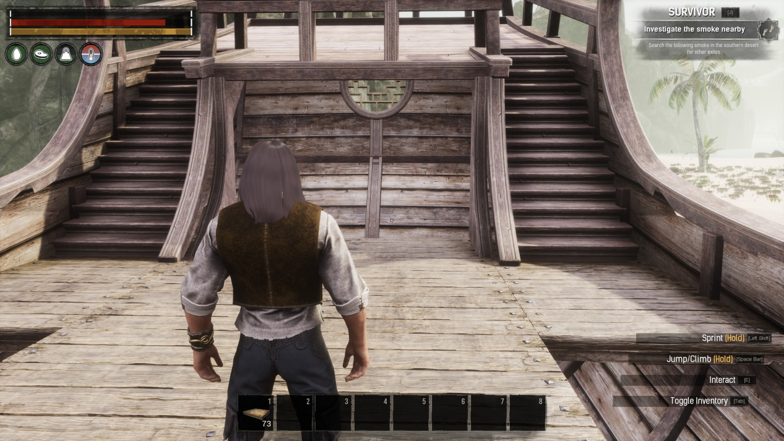

# Ships Of The Exiled

Welcome to the documentation page for the **Ships Of The Exiled** (SotE) mod for Conan Exiles!
Here, you'll find information on what is included in the mod, and how you can use it.

## Table of Contents

* [What does this mod do?](#what-does-this-mod-do)
* [Building Ships](#building-ships)
* [Placing, Launching and Steering](#placing-launching-and-steering)
* [Ship Types](#ship-types)
* [Important Notes](#important-notes)

## What does this mod do?

This mod has one (ambitious) goal: to add ships to the game! Different types of ships are
available, and all of them can actually be controlled and move across bodies of water.
Some of them are _buildable_, which means that you can construct their decks, masts and
everything you want on it, in the way you want it to look.
Any placeables you add to the ship will also stay with the ship, and remain fully functional.

Before you install this mod on a server, please make sure to read the [important notes](#important-notes)!

## Building Ships

To start building ships, you'll first need to learn the **Shipwright** feat. This feat will give you
all the recipes you need to build your own ships, from tiny rowboats to huge galleons.

### Building Materials

Most of the ships are built from intermediate components, such as frames, hull planks and sails.
You'll find all of them in three crafting stations:

* **Carpenter's Bench**: is where you build the ship frame, planks, masts, oars and the final ship itself.
* **Artisan Table**: is where you build sails and rigging.
* **Blacksmith's Bench**: is where you build steering wheels and anchors.

## Placing, Launching and Steering

### Placing

When you've got a ship (or boat) ready for use, head over to a body of water that's sufficiently large, and
place down the ship. Note that some of the larger ships may have trouble detecting sufficient water; in this
case try to stand a bit further away from the water and place the ship from further away.

At this moment, the ship is simply a placeable. Note that it's not bobbing on the waves yet.
Now is the time to add some more pieces to it, such as an oar or steering wheel!

### Launching

Before you can head out and sail across the vast seas, you must first **launch** the ship.
To do this, hold **E** on the ship to access the interaction wheel, and choose the **Launch** option.

As soon as the ship is launched, it will start bobbing on the waves (except for the large ships which do
not bob for technical and practical considerations).
If you open the interaction wheel again, you'll note that instead of the _Launch_ option, there are now
several new options: 

* **Change Mode: Afloat**: this will change the mode from **Anchored** to **Afloat**. You cannot steer a ship when
it's in the Anchored state, but you can add placeables to it. In the Afloat mode, it's the other way around:
you can steer it, but you cannot attach any placeables to it. When you Launch a ship, it will be in the Afloat
state initially.

* **Change Mode: Anchored**: change the mode from **Afloat** to **Anchored**. See above for more details.

* **Scuttle**: this will destroy the whole ship, along with everything placed on it! **USE WITH CARE!** You may
want to recover any placeables before scuttling the ship.

* **Steer**: start steering the ship. If you do not see this option on your boat, it may require a steering component instead,
such as an **oar**. After placing the oar, the Steer option will appear on the oar's interaction wheel.

### Steering

To start controlling a boat, open the interaction wheel on an oar, steering wheel or the boat itself and select
the **Steer** option. Your character will take place at the helm, the camera will zoom out, and a **steering info panel**
will appear in the top center of your screen.

_Note:_ you can't control ships that do not belong to your clan!

## Ship Types

### Rowboats

Rowboats are the smallest type of vessel available in SotE. They are also the easiest and cheapest to build.

#### Simple Rowboat

#### Slender Rowboat

#### Large Rowboat

### Rafts

Rafts are cheap to construct, just like rowboats, but offer a bit more space to put down some placeables.

### Triremes

If you're looking for naval transportation in style, make sure to try out one of the three trireme variants.
They offer a large deck with room for many placeables and/or passengers!

#### Variant A

#### Variant B

#### Variant C

### Khitan Vessel

The Khitan Vessel is a **buildable ship**, meaning that you can construct it (almost) entirely to your own wishes.
It starts off as a hull with some railings and other pieces, but without any deck. Instead, there are two layers
of **building sockets** where you can snap ceiling pieces onto.

#### Building on the Khitan Vessel

First, place down the ship like any other ship from this mod.

Once placed, climb on it. If you're having trouble climbing over the railing, try the inclined part near the sets of stairs.

Grab some ceiling pieces and you'll see that there are multiple building sockets where the ceiling can be snapped onto.

There is a second layer exactly one wall higher, allowing you to build an upper and lower deck:

With the decks in place, feel free to add any number of walls, doors, hatches, placeables etc. When you're all done, [launch](#launching-and-steering) the ship.

## Important Notes

* **THIS MOD IS NOT BALANCED FOR PVP!** Needless to say, having an invulnerable mobile base will completely destroy PVP balance.
* **THIS MOD IS EXPERIMENTAL**: Please keep this in mind when installing and using the mod! You may log in one day and find that 
your ship has decided to head off into the outer cosmos, along with anything you placed on the ship. Hopefully this will never happen,
but it MIGHT.