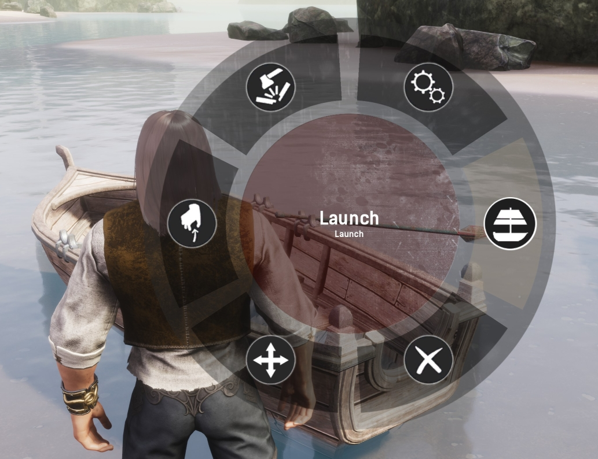
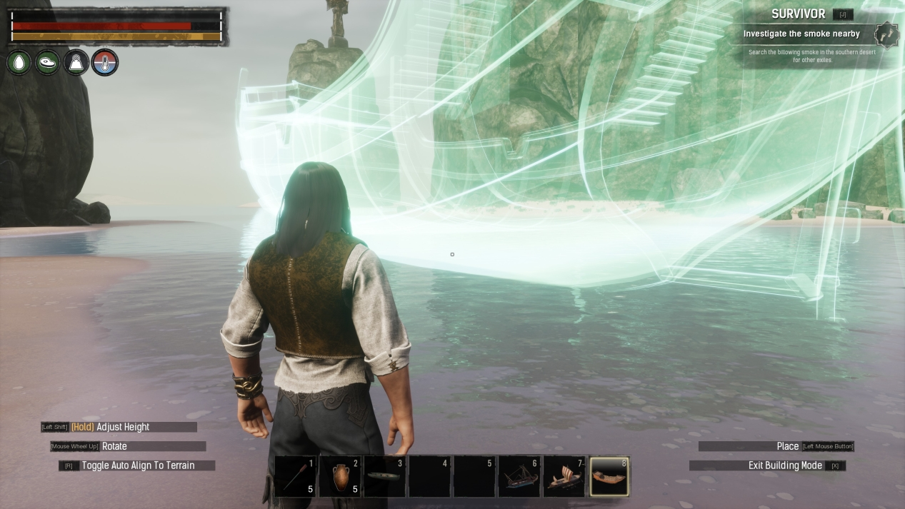
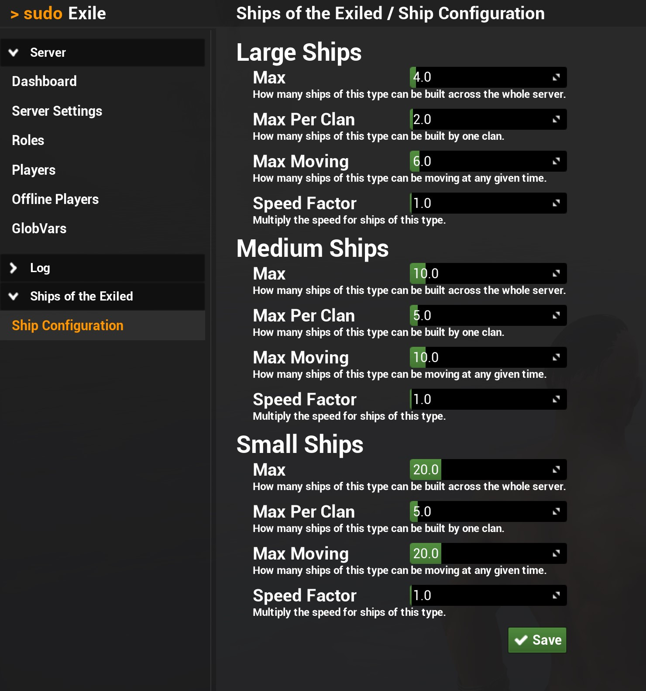

# Ships Of The Exiled

Welcome to the documentation page for the **Ships Of The Exiled** (SotE) mod for Conan Exiles!
Here, you'll find information on what is included in the mod, and how you can use it.

## Important Notes

* **THIS MOD IS IN EXPERIMENTAL ACCESS PHASE**: Please keep this in mind when installing and using the mod! You may log in one day and find that 
your ship has decided to head off into the outer cosmos, along with anything you placed on it. Hopefully this will never happen
to you, but it MIGHT.

* **THIS MOD IS NOT BALANCED FOR PVP!** Needless to say, having an invulnerable, mobile base will completely wreck the PVP balance of your server.

* **Thralls don't behave well on moving ships** A thrall in guard mode will guard their spot relative to the world, not relative to the ship! This means that they WILL fall off if the ship moves away from their guard spot.

* Please check the Discord server if you have questions or want to report an issue: [https://discord.com/invite/FtWrKAZ](https://discord.com/invite/FtWrKAZ)

## Table of Contents

* [What does this mod do?](#what-does-this-mod-do)
* [Building Ships](#building-ships)
* [Ship Mechanics](#ship-mechanics)
* [Ship Types](#ship-types)
* [Admin Settings](#admin-settings)

## What does this mod do?

This mod has one (ambitious) goal: to add ships to the game! Different types of ships are
available, and all of them can actually be controlled and move across bodies of water.
Some of them are _buildable_, which means that you can construct their decks, masts and
everything you want on it, in the way you want it to look.
Any placeables you add to the ship will also stay with the ship, and remain fully functional.

Before you install this mod on a server, please make sure to read the [important notes](#important-notes)!

## Building Ships

To start building ships, you'll first need to learn the **Shipwright** feat. This feat will give you
all the recipes you need to build your own ships, from tiny rowboats to huge galleons.

### Building Materials

Most of the ships are built from intermediate components, such as frames, hull planks and sails.
You'll find all of their recipes in three crafting stations:

* **Carpenter's Bench** is where you build the ship frame, planks, masts, oars and the final ship itself.
* **Artisan Table** is where you build sails and rigging.
* **Blacksmith's Bench** is where you build steering wheels and anchors.

## Ship Mechanics

### Placing a Ship

When you've got a ship (or boat) ready for use, head over to a body of water that's sufficiently large, and
place down the ship. Note that some of the larger ships may have trouble detecting sufficient water; in this
case try to stand a bit further away from the water and place the ship from further away.

At this moment, the ship is simply a static placeable. Note that it's not bobbing on the waves yet.
Now is the time to add some more pieces to it, such as an oar or steering wheel!

Also, there may be water flowing over the deck. Fear not, your boat is not sinking before even its
maiden voyage! As soon as you start controlling it, the boat will rise to float atop the water surface.

### Launching

Before you can head out and sail across the vast seas, you must first **launch** the ship.
This action will convert the ship from a static placeable into a movable actor.
To do this, hold **E** on the ship to access the interaction wheel, and choose the **Launch** option.

As soon as the ship is launched, it will start bobbing on the waves (except for the large ships which do
not bob for practical considerations).
If you open the interaction wheel again, you'll note that instead of the _Launch_ option, there are now
several new options: 

* **Change Mode: Afloat**: this will change the mode from **Anchored** to **Afloat**. You cannot steer a ship when
it's in the Anchored state, but you can add placeables to it. In the Afloat mode, it's the other way around:
you can steer it, but you cannot attach any placeables to it. When you Launch a ship, it will be in the Afloat
state initially.

* **Change Mode: Anchored**: change the mode from **Afloat** to **Anchored**. See above for more details.

* **Scuttle**: this will destroy the ship, along with everything placed on it. **USE WITH CARE!** You may
want to recover any placeables, and ask passengers to leave, before scuttling the ship.

* **Steer**: start steering the ship. If you do not see this option on your boat, it may require a steering component instead,
such as an **oar** or **steering wheel**. After placing the oar, the Steer option will appear on the oar's interaction wheel.

### Steering

To start controlling a boat, open the interaction wheel on an oar, steering wheel or the boat itself and select
the **Steer** option. Your character will take place at the helm, the camera will zoom out, and a **steering info panel**
will appear in the top center of your screen.

_Note:_ you can't control ships that do not belong to your clan!

To move the boat, use the same keys that you use for character movement (i.e. WASD). Using the Autorun button will also
work on boats, causing them to accelerate forward automatically.

The info panel will display some useful stats about your heading and velocity, and also notify you if any obstacles are
preventing you from steering the boat forwards or backwards.

## Ship Types

### Overview

| Ship           | Size   | Top Speed | Acceleration | Turn Rate |
| -------------- | ------ | --------- | ------------ | --------- |
| Rowboat        | Small  | 500       | 100          | 2         |
| Raft           | Small  | 600       | 128          | 1         |
| Trireme        | Medium | 700       | 90           | 1         |
| Khitan Vessel  | Medium | 750       | 90           | 1         |
| Galleon        | Large  | 850       | 70           | 1         |
| Stygian Raider | Large  | 900       | 90           | 1         |

### Rowboat

Rowboats are the smallest type of vessel available in SotE, and they are also the easiest and cheapest to construct.
They are handy for rowing down rivers and streams, and can carry some cargo and perhaps a passenger or two.

#### Simple Rowboat

#### Slender Rowboat

#### Large Rowboat

### Raft

Just like rowboats, rafts are also cheap to construct, but they offer a bit more space to put down your placeables.

### Trireme

If you're looking for naval transportation in style, make sure to try out one of the trireme variants.
They are large, look stately, and offer a large deck with room for many placeables and/or passengers!

#### Variant A

#### Variant B

#### Variant C

### Khitan Vessel

The Khitan Vessel is a **buildable ship**, meaning that you can build it up (almost) entirely to your own wishes.
It starts off as a hull with some railings, but without any deck. Instead, it contains two layers of **building sockets**
where you can snap ceiling pieces onto.

#### Building on the Khitan Vessel

First, place down the hull like any other ship from this mod.

Once placed, climb onto it. If you're having trouble reaching over the railing, try the inclined part near the sets of stairs.

Grab some ceiling pieces and you'll see that there are multiple building sockets where the ceilings can be snapped onto.

There is a second layer exactly one wall higher, allowing you to build an upper and lower deck:

With the decks in place, feel free to add any number of walls, doors, hatches, placeables etc. When you're all done, [launch](#launching) the ship.

### Stygian Raider

The Stygian Raider is an imposing vessel, classified as a large ship type and quite costly to build.
But don't be fooled by its size: this sleek warship has the highest maximum speed of all ships currently in SotE!

### Galleon

Building a galleon is a task that should not be undertaken lightly. It costs a vast amount of resources to build, and it is certainly not the fastest
ship out there. But what you get in the end may well be worth it: this enormous ship offers plenty of room to accommodate an entire clan, boasting three
decks and numerous cabins and staircases.

_Admin note:_ for performance reasons, make sure to limit the number of placeables allowed! See the setting `largeShipsMaxPlaceables` in the [admin settings](#admin-settings).

## Admin Settings

Administrators can configure a number of settings related to the ships. This can be done in two ways:

#### Sudo Exile

If you have the mod [Sudo Exile](https://steamcommunity.com/sharedfiles/filedetails/?id=2842779736) running, you can obtain the **ShipManager** permission,
which will give you access to the Ship settings page:

*Note:* Sudo Exile is not a requirement. If you don't have Sudo Exile, you can still use the console commands listed below.

#### Console

As an administrator, you can open the console (by default using the tilde '~' sign), and configure the ship settings using the below commands (case sensitive!):

- `DataCmd SOTE ShipAdmin`: This will enable you to control any ship regardless of ownership, as well as move ships across land (e.g. to get a beached ship back into the water). Enter the command again to toggle it off.

- `DataCmd SOTE set largeShipsMax <value>`: Set the global maximum number of large ships that can be in the game.
- `DataCmd SOTE set largeShipsMaxClan <value>`: Set the maximum number of large ships that can be in the game, per clan.
- `DataCmd SOTE set largeShipsMaxMoving <value>`: Set the maximum number of large ships that can be moving at any given time.
- `DataCmd SOTE set largeShipsSpeedFactor <value>`: Set the speed factor to apply to all large ships.
- `DataCmd SOTE set largeShipsMaxPlaceables <value>`: Set the maximum number of placeables that a large ship can carry.

- `DataCmd SOTE set medShipsMax <value>`: Set the global maximum number of medium ships that can be in the game.
- `DataCmd SOTE set medShipsMaxClan <value>`: Set the maximum number of medium ships that can be in the game, per clan.
- `DataCmd SOTE set medShipsMaxMoving <value>`: Set the maximum number of medium ships that can be moving at any given time.
- `DataCmd SOTE set medShipsSpeedFactor <value>`: Set the speed factor to apply to all medium ships.
- `DataCmd SOTE set medShipsMaxPlaceables <value>`: Set the maximum number of placeables that a medium ship can carry.

- `DataCmd SOTE set smallShipsMax <value>`: Set the global maximum number of small ships that can be in the game.
- `DataCmd SOTE set smallShipsMaxClan <value>`: Set the maximum number of small ships that can be in the game, per clan.
- `DataCmd SOTE set smallShipsMaxMoving <value>`: Set the maximum number of small ships that can be moving at any given time.
- `DataCmd SOTE set smallShipsSpeedFactor <value>`: Set the speed factor to apply to all small ships.
- `DataCmd SOTE set smallShipsMaxPlaceables <value>`: Set the maximum number of placeables that a small ship can carry.

To view the current value for any of these settings, use the following command:

- `DataCmd SOTE get <key>`: for example, `DataCmd SOTE get largeShipsMax`

